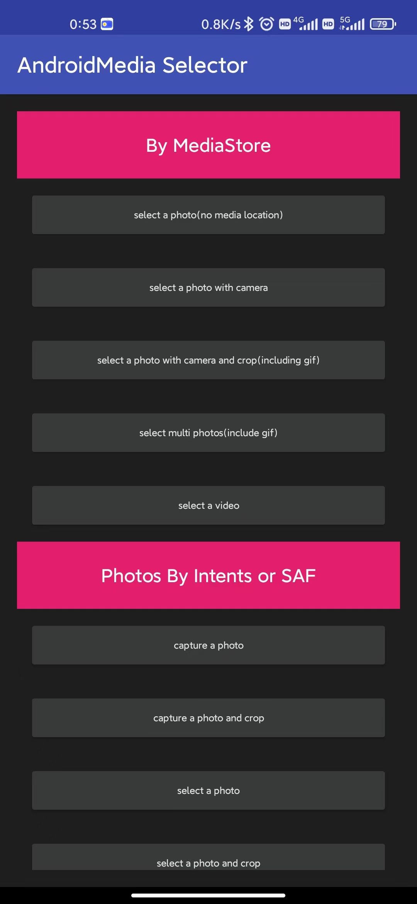

# Lib Media Selector

Android 多媒体文件选择库，支持 **`target api = 33`** 【调用 API 之前，请保证相关的权限均已获取】。



## 1 支持应用内多媒体文件选择

### 基于 boxing 封装

由于 boxing 内部存在一些 bug，且官方不再维护，这里对 bug 进行了修复。

boxing 库存在以下问题：

1. [RotatePhotoView](https://github.com/ChenSiLiang/RotatePhotoView) 依赖混乱导致的崩溃。
2. [Android 10 SQLiteException](https://github.com/bilibili/boxing/issues/154)
   崩溃问题，解决方案可以参考  [replacement-for-group-by-in-contentresolver-query-in-android-q-android-10-a](https://stackoverflow.com/questions/60623594/replacement-for-group-by-in-contentresolver-query-in-android-q-android-10-a)
   和 [https://stackoverflow.com/questions/56823336/query-mediastore-on-android-q](https://stackoverflow.com/questions/56823336/query-mediastore-on-android-q)
   。
3. Android 11 invalid token
   limit，解决方案可以参考 [limiting-number-of-rows-in-a-contentresolver-query-function](https://stackoverflow.com/questions/10390577/limiting-number-of-rows-in-a-contentresolver-query-function)
4. 没有适配 Android 10 的 ScopedStorage。

另外，使用时需要配置好 FileProvider：

- xml/file_path

```xml
<?xml version="1.0" encoding="utf-8"?>
<paths>
    <files-path name="app_internal" path="/" />
    <cache-path name="app_internal_cache" path="/" />
    <external-cache-path name="app_external_cache" path="/" />
    <external-files-path name="app_external" path="/" />
    <external-path name="app_external" path="/" />
</paths>
```

- manifest

```xml

<provider android:name="androidx.core.content.FileProvider"
    android:authorities="${applicationId}.file.provider" android:exported="false"
    android:grantUriPermissions="true">
    <meta-data android:name="android.support.FILE_PROVIDER_PATHS"
        android:resource="@xml/file_path" />
</provider>
```

### 其他可选方案

- [EasyPhotos](https://github.com/HuanTanSheng/EasyPhotos)
- [PictureSelector](https://github.com/LuckSiege/PictureSelector)
- [ImageSelector](https://github.com/smuyyh/ImageSelector)

## 2 支持使用系统内置组件进行文件选择

SystemMediaSelector 用于调用系统相机或 SAF 获取图片或文件。

需要考虑的问题：

1. Android 7.0 默认启动严苛模式。
2. 获取的图片方向问题，需要通过 exif 修正。
3. 系统返回的不是 file 路径，而是其他类型的 uri，需要通过相关方法转换。

相关参考：

- [官方文档：拍照](https://developer.android.com/training/camera/photobasics)
- [官方文档：从共享存储空间访问文档和其他文件](https://developer.android.com/training/data-storage/shared/documents-files?hl=zh-cn)
- [官方文档：Android 存储用例和最佳做法](https://developer.android.com/training/data-storage/use-cases?hl=zh-cn#capture-image-media)
- [Android. How to capture image from camera and store it in server?](https://stackoverflow.com/questions/53645370/android-how-to-capture-image-from-camera-and-store-it-in-server)
- [你需要知道的 Android 拍照适配方案](http://www.jianshu.com/p/f269bcda335f)
- [Android 调用系统相机和相册-填坑篇](http://wuxiaolong.me/2016/05/24/Android-Photograph-Album2/)
- [Android 大图裁剪](http://ryanhoo.github.io/blog/2014/06/03/the-ultimate-approach-to-crop-photos-on-android-2/)
- [get-filename-and-path-from-uri-from-media-store](https://stackoverflow.com/questions/3401579/get-filename-and-path-from-uri-from-mediastore)
- [how-to-get-the-full-file-path-from-uri](https://stackoverflow.com/questions/13209494/how-to-get-the-full-file-path-from-uri)

## 3 支持图片裁剪

使用系统裁剪时发现不同设备厂商以及不同系统版本之间有这样那样的问题，于是决定内置图片裁剪库，可选裁剪库有：

- [uCrop](https://github.com/Yalantis/uCrop)
- [smartCropper](https://github.com/pqpo/SmartCropper)
- [simpleCropper](https://github.com/igreenwood/SimpleCropView)
- [Android-Image-Cropper](https://github.com/ArthurHub/Android-Image-Cropper)

目前采用的是 uCrop。

## 4 Usage

```kotlin
class MainActivity : AppCompatActivity() {

    private val systemMediaSelector by lazy {
        newSystemMediaSelector(this, object : ResultListener {
            override fun onTakeSuccess(result: List<Uri>) {
                result.forEach {
                    Timber.e(it.toString())
                }
                showResult(result)
            }
        })
    }

    private val mediaSelector by lazy {
        newMediaSelector(this, object : ResultListener {
            override fun onTakeSuccess(result: List<Uri>) {
                result.forEach {
                    Timber.e(it.toString())
                }
                showResult(result)
            }
        })
    }

    override fun onRestoreInstanceState(savedInstanceState: Bundle) {
        super.onRestoreInstanceState(savedInstanceState)
        systemMediaSelector.onRestoreInstanceState(savedInstanceState)
        mediaSelector.onRestoreInstanceState(savedInstanceState)
    }

    override fun onSaveInstanceState(outState: Bundle) {
        super.onSaveInstanceState(outState)
        systemMediaSelector.onSaveInstanceState(outState)
        mediaSelector.onSaveInstanceState(outState)
    }

    override fun onActivityResult(requestCode: Int, resultCode: Int, data: Intent?) {
        super.onActivityResult(requestCode, resultCode, data)
        systemMediaSelector.onActivityResult(requestCode, resultCode, data)
        mediaSelector.onActivityResult(requestCode, resultCode, data)
    }

    ///////////////////////////////////////////////////////////////////////////
    // MediaStore
    ///////////////////////////////////////////////////////////////////////////
    fun selectOnePhotoByMediaStore(view: View) {
        mediaSelector.takePicture().start()
    }

    fun selectOnePhotoWithCameraByMediaStore(view: View) {
        mediaSelector.takePicture().needMediaLocation().enableCamera().start()
    }

    fun selectOnePhotoWithCameraAndCropByMediaStore(view: View) {
        mediaSelector.takePicture().needMediaLocation().enableCamera().crop().needGif().start()
    }

    fun selectMultiPhotoByMediaStore(view: View) {
        mediaSelector.takePicture().needMediaLocation().count(9).needGif().start()
    }

    fun selectOneVideoByMediaStore(view: View) {
        mediaSelector.takeVideo().needMediaLocation().start()
    }

    ///////////////////////////////////////////////////////////////////////////
    // Photos by Intent or SAF
    ///////////////////////////////////////////////////////////////////////////
    fun captureOnePhoto(view: View) {
        systemMediaSelector.takePhotoByCamera().start()
    }

    fun captureOnePhotoAndCrop(view: View) {
        systemMediaSelector.takePhotoByCamera().crop().start()
    }

    fun selectOnePhoto(view: View) {
        systemMediaSelector.takePhotoFromSystem().start()
    }

    fun selectOnePhotoAndCrop(view: View) {
        systemMediaSelector.takePhotoFromSystem().crop().start()
    }

    fun selectPhotos(view: View) {
        systemMediaSelector.takePhotoFromSystem().multiple(true).start()
    }

    ...

}
```

## 5 Installation

```groovy
implementation 'io.github.ztiany:android-media-selector:1.1.1'
```
